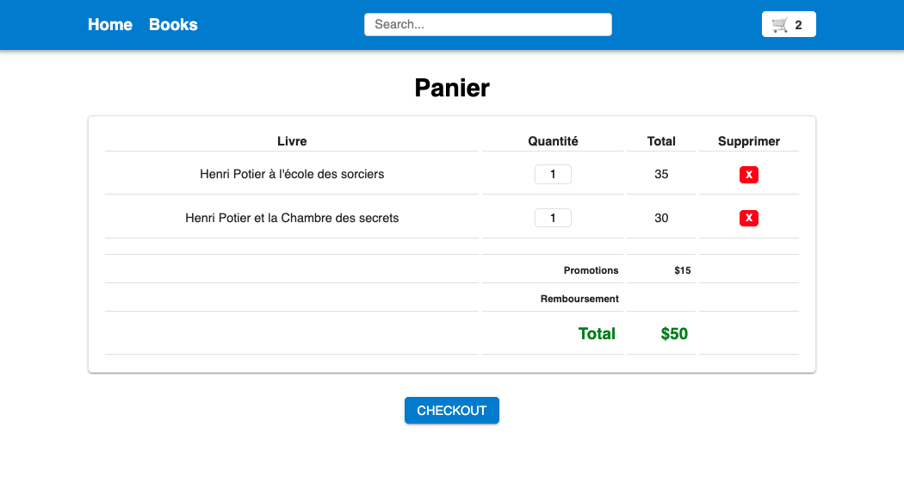
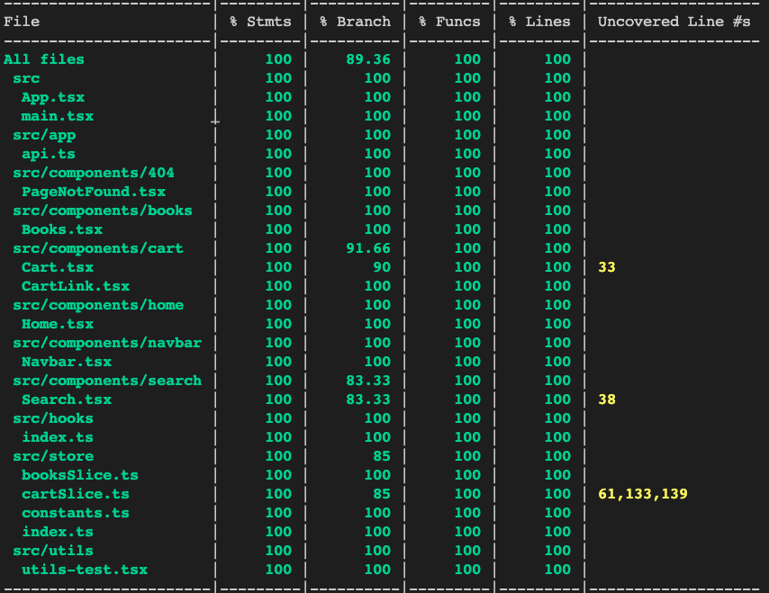

## La bibliothèque d`Henri Potier

## Preview





## Setup

### Installation

```bash
$ npm install
```

### Run app (first run the api to use secure payment)

```sh
$ npm run dev
```

### Run tests

```sh
$ npm run test
```

### Run tests with coverage

```sh
$ npm run test:coverage
```

### Run Prettier

```sh
$ npm run format
```

### Run Eslint

```sh
$ npm run eslint
```

### Run Build

```sh
$ npm run build
```
### Run Preview

```sh
$ npm run preview
```

## Technologies

- [Vite](https://vitejs.dev/)
- [React Router](https://reactrouter.com/)
- [TypeScript](https://www.typescriptlang.org/)
- [CSS Modules](https://github.com/css-modules/css-modules)
- [Redux Toolkit](https://redux-toolkit.js.org)
